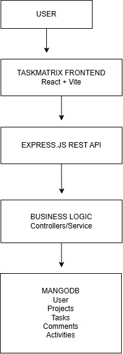
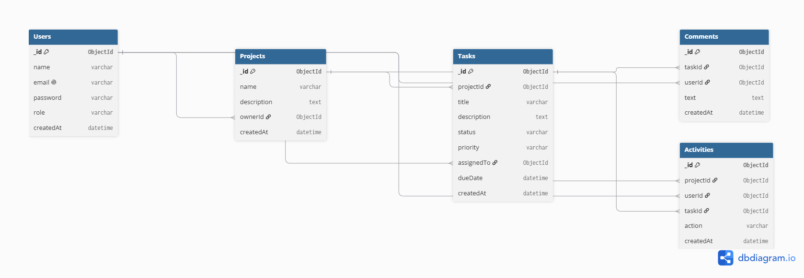

# TaskMatrix

> A full-stack Agile project management platform designed for software teams to manage projects, tasks, deadlines, priorities, and team collaboration.

## Project Overview

TaskMatrix is a Jira/Asana-inspired project management platform for software development teams. It provides a centralized workspace where teams can create projects, manage tasks, assign responsibilities, track deadlines, and monitor project activity through a Kanban-based workflow.

The application is designed as a scalable full-stack solution with a React frontend, Express.js backend, and MongoDB database.

## Designated Track

**Fullstack Developer**

## Project Objective

The primary objective of TaskMatrix is to provide software teams with a simple and centralized platform for managing Agile workflows.

The system will focus on:

* Project management
* Task management
* Team collaboration
* Task assignment
* Priority and deadline tracking
* Kanban workflow management
* Role-based access control
* Project activity tracking

## Tech Stack

### Frontend

* React.js
* Vite
* Tailwind CSS
* Shadcn UI
* React Router
* Zustand

### Backend

* Node.js
* Express.js
* REST API
* JWT Authentication

### Database

* MongoDB
* Mongoose

### Development & Design Tools

* Git
* GitHub
* Postman
* Figma
* Draw.io / dbdiagram.io

### Deployment

* Vercel
* Render
* MongoDB Atlas

## User Roles

### Admin

* Manage users
* Manage projects
* Manage user roles
* Delete projects
* Monitor system activity

### Manager

* Create and manage projects
* Add team members
* Create and assign tasks
* Manage task priorities and deadlines
* Monitor project progress

### Member

* View assigned projects
* View and update assigned tasks
* Change task status
* Add comments
* Track personal tasks

## Core Features

### P0 — Must Have

#### Authentication

* User registration
* User login
* JWT-based authentication
* Protected routes
* Logout

#### Project Management

* Create project
* View projects
* Update project
* Delete project
* Add and manage team members

#### Task Management

* Create tasks
* Edit tasks
* Delete tasks
* Assign tasks to team members
* Set task priority
* Set task deadline
* Automated deadline tracking using scheduled jobs (cron)
* Update task status

#### Kanban Board

* To Do
* In Progress
* Review
* Done
* Drag-and-drop task management

### P1 — Important Features

* Task search
* Task filtering
* Task sorting
* Task comments
* Real-time project activity feed
* Dashboard statistics
* Team management

### P2 — Future Features

* Real-time task updates
* Notifications
* AI-powered project assistance
* Advanced analytics

## Database Collections

The application will use the following MongoDB collections:

* Users
* Projects
* Tasks
* Comments
* Activities

Relationships between these collections will be documented through the Entity Relationship Diagram (ERD).

## Planned API Architecture

### Authentication

* `POST /api/auth/register`
* `POST /api/auth/login`
* `GET /api/auth/me`

### Users

* `GET /api/users`
* `GET /api/users/:id`
* `PUT /api/users/:id`
* `DELETE /api/users/:id`

### Projects

* `GET /api/projects`
* `POST /api/projects`
* `GET /api/projects/:id`
* `PUT /api/projects/:id`
* `DELETE /api/projects/:id`

### Tasks

* `GET /api/projects/:projectId/tasks`
* `POST /api/projects/:projectId/tasks`
* `GET /api/tasks/:id`
* `PUT /api/tasks/:id`
* `DELETE /api/tasks/:id`

### Comments

* `GET /api/tasks/:taskId/comments`
* `POST /api/tasks/:taskId/comments`

### Activities

* `GET /api/projects/:projectId/activities`

## UI/UX Design

The TaskMatrix interface will be designed using Figma with responsive layouts for desktop and mobile devices.

Core UI/UX screens:

### Desktop
1. Login
2. Dashboard
3. Kanban Board

### Mobile
1. Mobile Login
2. Mobile Dashboard
3. Mobile Kanban Board
   
**Figma Design:** TaskMatrix UI/UX Design https://www.figma.com/design/6GIvTyNg9kbxWm90EdLDr3/TaskMatrix-UI-UX-Design?node-id=0-1&t=V909lnRUAxJcbzSV-1

## System Architecture

### Architecture Diagram



TaskMatrix will follow a client-server architecture:

```text
User
  ↓
TaskMatrix Frontend
React + Vite
  ↓
Express.js REST API
  ↓
Business Logic
Controllers / Services
  ↓
MongoDB
Users / Projects / Tasks / Comments / Activities
```

JWT authentication will be used to secure protected API routes and role-based access control will determine which actions each user role can perform.

## Database Design

### Entity Relationship Diagram



The database architecture will contain five primary collections:

```text
Users
Projects
Tasks
Comments
Activities
```

The detailed relationships and fields will be documented in the project's ERD.

## Project Roadmap

### Sprint 13 — Planning & Architecture

* Product Requirements Document
* UI/UX wireframes
* Database ERD
* System architecture
* API planning
* Prompt engineering documentation

### Sprint 14 — MVP Development

* Frontend setup
* Backend setup
* Database integration
* Authentication
* Project management
* Basic task management
* Kanban board

### Sprint 15 — Full Feature Completion

* Complete CRUD operations
* Role-based access control
* Comments
* Activity feed
* Search and filtering
* Team management

### Sprint 16 — AI Integration & UX Polish

* AI-powered functionality
* UX improvements
* Performance improvements
* Additional collaboration features

### Sprint 17 — Deployment & Go-Live

* Testing
* CI/CD
* Production deployment
* Final optimization
* Final demonstration

## Documentation

* [Product Requirements Document](README.md)
* [AI Prompt Engineering Log](Prompts.md)
* Database ERD — dbdiagram.io
* System Architecture — Draw.io

## Project Status

**Current Phase:** Sprint 13 — Planning & Architecture

**Development Status:** Blueprint / Planning Phase
